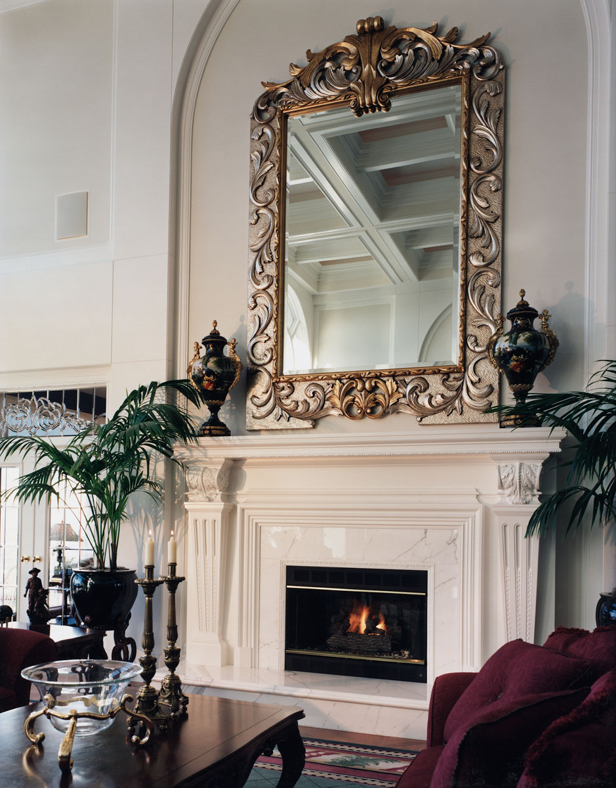

# Miller Residence

  
  
  

Reproduction of mantel photograph found in an architectural Digest design
magazine by homeowner, objectives: match photo as closely as possible and
enlarge to fit site conditions. Fabricate, architectural ornamentation install
on corbels and mantel installation.
